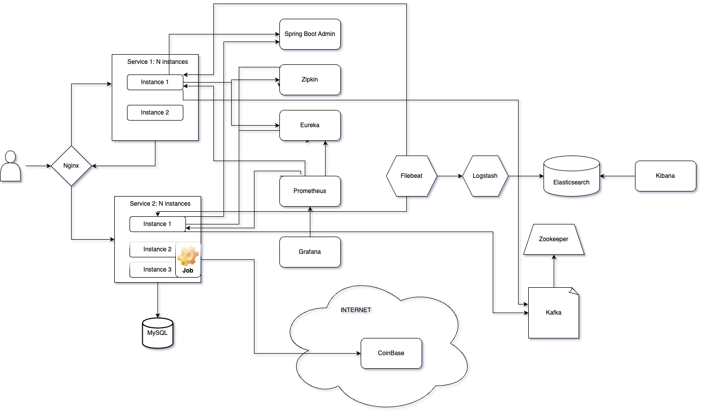

# POC-Microservices

## This is a proof of concept for microservices architecture using Docker, React, Spring Boot and MySql.

### The project is divided into 3 services:
- Frontend (React + Spring Boot)
- Backend (Spring Boot)
- Backend (Micronaut - wip)

### Other services that are used:
- Database (MySql)
- Reverse Proxy (Nginx)
- Service Discovery (Eureka)
- Tracing (Zipkin or Grafana Tempo)
- Monitoring (Prometheus, Spring Admin, Grafana)
- Logging (FileBeat, LogStash, ELK or Grafana Loki)
- Messaging (Kafka)
- API Monitoring (Spring Boot Actuator)
- API Documentation (Swagger - wip)
- Docker Compose
- Kubernetes (wip)

### Arhitecture Diagram

### Mermaid Diagram (wip)
[Mermaid Diagram](mermaid.md)

### How to run the project
- Clone the repository
- Run `docker-compose up --build` in the root folder
- Open `http://localhost:80` in your browser
- Open `http://localhost:8080/swagger-ui.html` in your browser to see the API documentation
- Open `http://localhost:8080/actuator` in your browser to see the API monitoring
- Open `http://localhost:8080/admin` in your browser to see the Spring Admin
- Open `http://localhost:8080/zipkin` in your browser to see the tracing
- Open `http://localhost:8080/prometheus` in your browser to see the monitoring
- Open `http://localhost:8080/grafana` in your browser to see the monitoring
